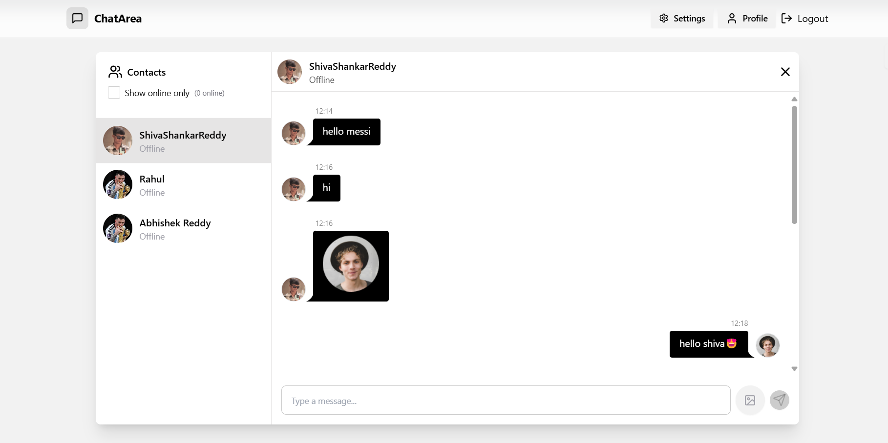
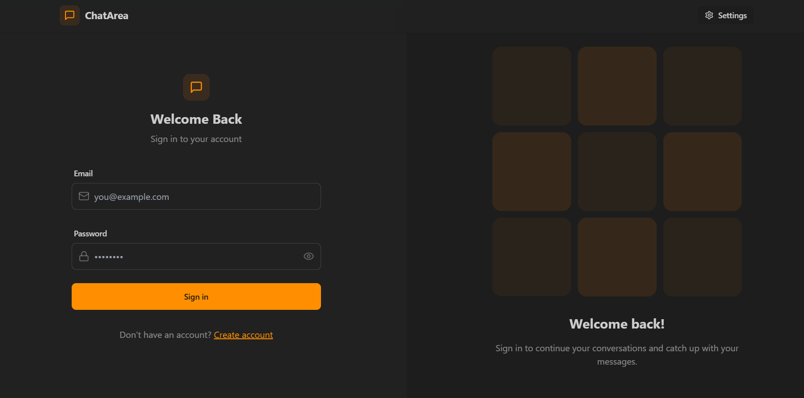
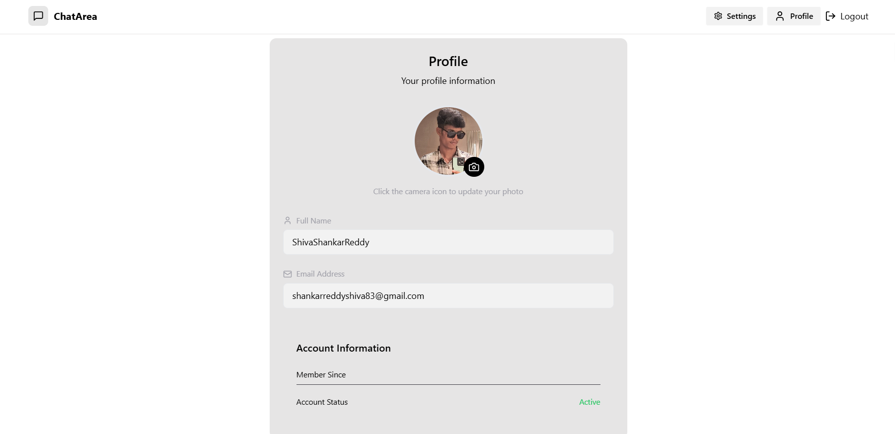

# Real-Time Chat Application

A fully functional real-time chat application built using modern web development technologies, providing secure user authentication, real-time messaging, online user tracking, and a responsive UI.

## Live

       https://chatapp-uv4h.onrender.com

## Features

- **Authentication & Authorization**: Secure user login and registration using JWT.
- **Real-Time Messaging**: Live chat powered by Socket.IO.
- **Online User Status**: Track and display online/offline status of users.
- **Global State Management**: Seamless state management with Zustand.
- **Responsive Design**: Mobile-friendly UI built with TailwindCSS and DaisyUI.
- **Error Handling**: Robust error handling on both the client and server sides.

## Tech Stack

### Frontend

- **ReactJS**: Frontend library for building the user interface.
- **TailwindCSS**: Utility-first CSS framework for styling.
- **DaisyUI**: TailwindCSS components for faster UI development.
- **Zustand**: State management library for maintaining global state.

### Backend

- **Node.js**: JavaScript runtime for server-side programming.
- **Express.js**: Web framework for building APIs and handling requests.
- **Socket.IO**: Library for real-time, bi-directional communication.
- **MongoDB**: NoSQL database for storing user data and messages.

### Tools & Utilities

- **JWT (JSON Web Tokens)**: Secure authentication and authorization.
- **Mongoose**: ODM library for MongoDB.

## Getting Started

Follow these instructions to set up and run the project on your local machine.

### Prerequisites

- **Node.js** (v14+)
- **MongoDB** (Local or cloud instance)
- **npm** or **yarn**

### Installation

1. **Clone the repository**:
   ```bash
   git clone <repository-url>
   ```

## ScreenShots

### Chat Page



### Login Page



### SignUp Page


### Setting Page


### Profile Page


